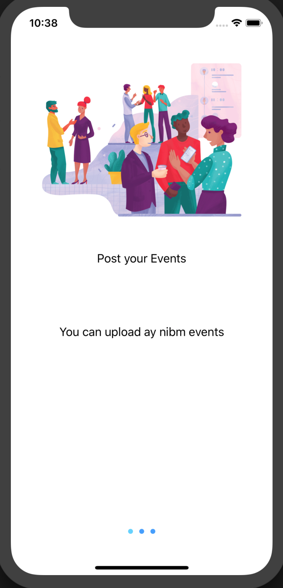
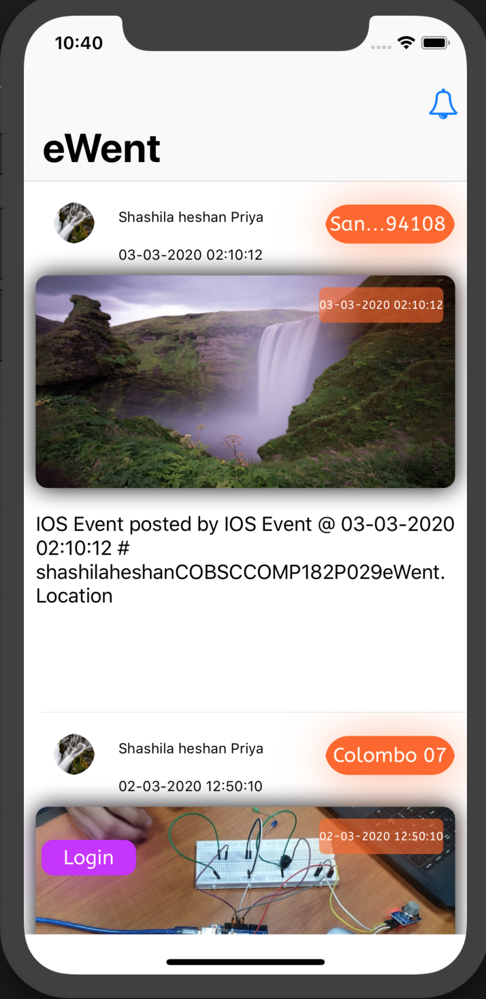
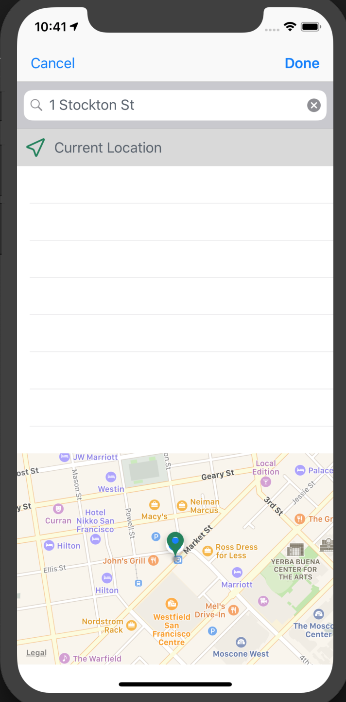
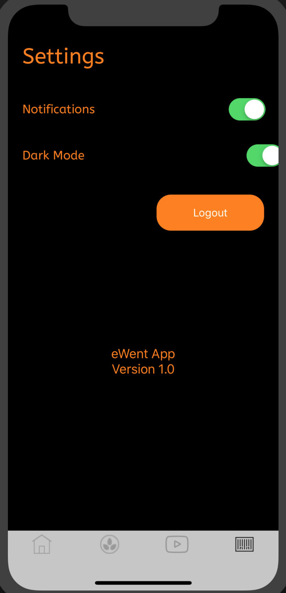

# INDEX-NO : COBSCCOMP182P-029
# NAME : SHASHILA HESHAN
# BATCH : COMPUTER SCIENCE 182P
# DESCRIPTION : A IOS APPLICATION TO HANDLE NIBM EVENTS , CRUD AND REALTIME NOTIFICATIONS BETWEEN DB AND CLIENTS USING SOCKETS
# TECH STACK
   1.MVVM ARCHITECTURE
   2.PROTOCOL ORIENTED MVVM
   3.FIRESTORE DATABASE WITH CACHING
   4.KINGFISHER WITH CACHING 
   5.LOTTIE REAL TIME ANIMATION
   6.USER BIOMETRICS
   7.LOCATION ENABLED WITH PICKER
# IMAGES

